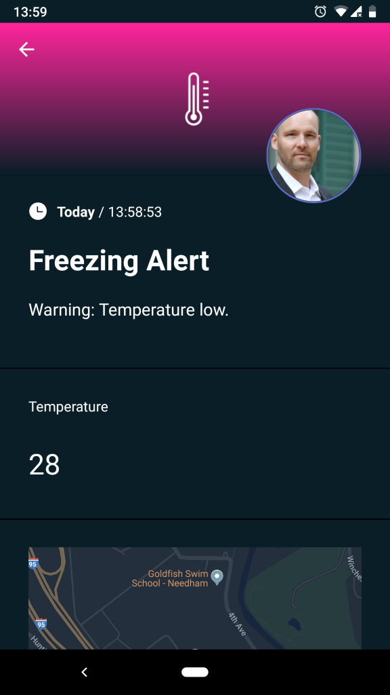
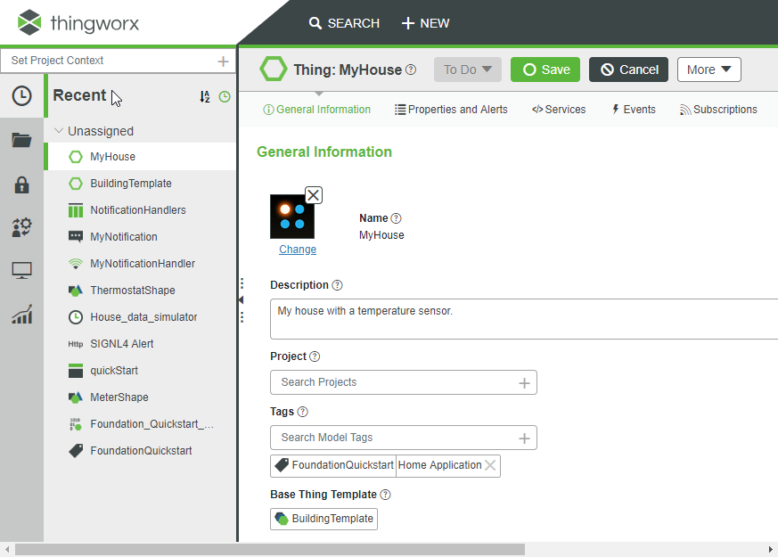
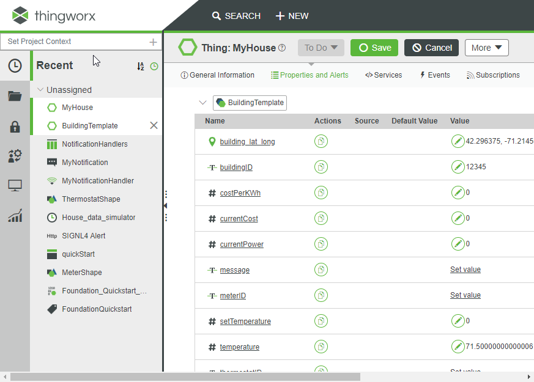
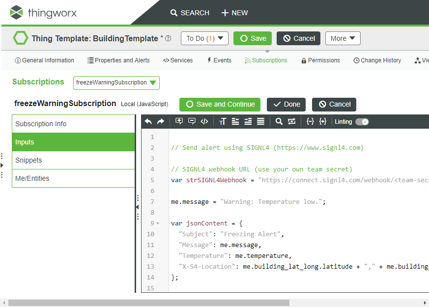
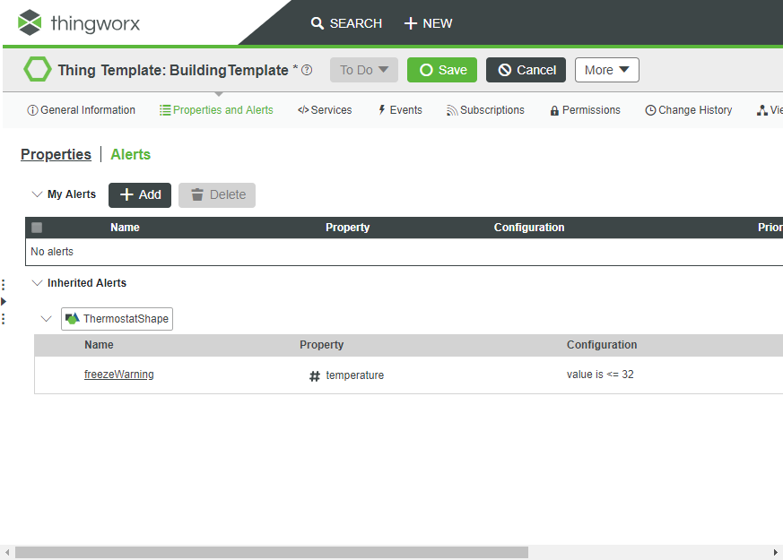

# Integrating SIGNL4 with PTC ThingWorx

Mobile alerting with tracking & escalation for PTC ThingWorx.

## Why SIGNL4

PTC ThingWorx is a platform for the development and deployment of smart, connected IoT (Internet of Things) devices. Pairing this powerful IoT platform with SIGNL4 can enhance your daily operations with an extension to your mobile team in the field or on the shop floor.

## How it Works

All it takes to pair ThingWorx and SIGNL4 is a small script in ThingWorx that calls the SIGNL4 webhook to trigger the alert.

## Integration Capabilities

- Service engineers alerted via mobile push, text and voice
- Staff can acknowledge and take ownership for critical events that occur
- Alerts are escalated in case of no response
- Communicate within an alert to address a particular problem
- Alert on critical device states
- Two-way integration to interact or set the device state

## Scenarios

- Industrial IoT
- Industry 4.0
- IoT Service Alerting
- IoT Device Management
- Manufacturing, Utility, Oil and Gas, Agriculture, etc.

## How To Integrate

### Integrating SIGNL4 with ThingWorx

Gathering events from IoT devices and sending team alerts in case of critical incidents is a broad field. It starts with simple prototypes using a Raspberry Pi and goes up to industrial IoT scenarios, machine data or distributed systems in the field.

SIGNL4 is a mobile alert notification app for powerful alerting, alert management and mobile assignment of work items. Get the app at https://www.signl4.com.

In our example we simulate a building with a temperature sensor and if the temperature is too low we raise an alert. The building, sensor and related entities are all defined in the ThingWorx portal.

### Prerequisites

A SIGNL4 (https://www.signl4.com) account

PTC ThingWorx (if you do not have an account yet you can get a free trial account here: https://developer.thingworx.com/en/profile/hosting)

The ThingWorx quick start guide: https://developer.thingworx.com/en/resources/guides/thingworx-foundation-quickstart

#### Integration Steps

1. Create the ThingWorx Scenario
If you have your IoT devices already defined in ThingWorx you can proceed with the next step. If not please follow the steps explained in this tutorial:
https://developer.thingworx.com/en/resources/guides/thingworx-foundation-quickstart
As a result you will have a MyHouse Thing with a temperature sensor.

The MyHouse Thing has several properties as defined in the tutorial. One property is the temperature.

This is what we monitor and if the temperature is too low we will raise an alert.

2. Create the Subscription in ThingWorx
Now, in our MyHouse Thing we create a subscription as already described in the tutorial.

The JavaScript code of this subscription contains the whole logic of sending the alert notification via SIGNL4. It puts all the necessary data into a JSON format and then sends an HTTP Post request to the SIGNL4 webhook URL. Please make sure you use your team secret here.

You can find a sample script in GitHub:
https://github.com/signl4/signl4-integration-thingworx

3. Create the Alert in ThingWorx
In order to trigger the above subscription we need an alert. We create the alert as described in the tutorial. The alert checks for certain conditions. In our case it triggers if the temperature is below 32 degrees.

4. Test It
We can now simulate a low temperature without the need to have an actual sensor or to wait for freezing temperatures. You can just go the the properties of the MyHouse Thing and edit the temperature value. Set it to 20 degrees for example. This as a result triggers the alert and the corresponding subscription sends the alert notification to SIGNL4 so your team will receive it.
